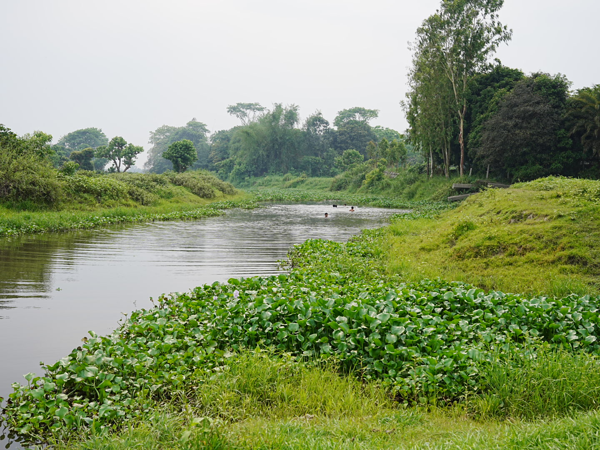

# Rafid's Gallery

A personal photography gallery built using GitHub Pages.  
Visit it at: `https://yourusername.github.io/rafids-gallery/`

Replace images in the `images/` folder with your own. Retain the naming sequence like "portraitsphoto4.JPG"
<
Update this part of your JavaScript like so:

const collections = {
  street: 8,
  portraits: 4,
  theatre: 3,
  landscapes: 3
};
>

To create a new folder
1. Create the Folder:
2. Add Content to the Folder:
3. Update Your JavaScript (If Needed):
    const collections = {
  street: 9,
  portraits: 4,
  theatre: 3,
  landscapes: 3,
  nature: 5 // Add this line for the new folder
};
4. Add the Folder to Your HTML:
    To display the new collection in your main gallery (on the index.html page), you’ll need to add a new div in the main section for the new folder.

    For example, after the existing collections, add a new block for the “Nature” collection:

  
  Nature

